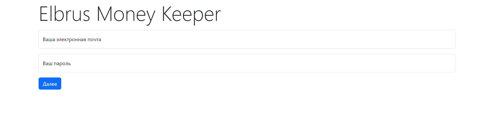
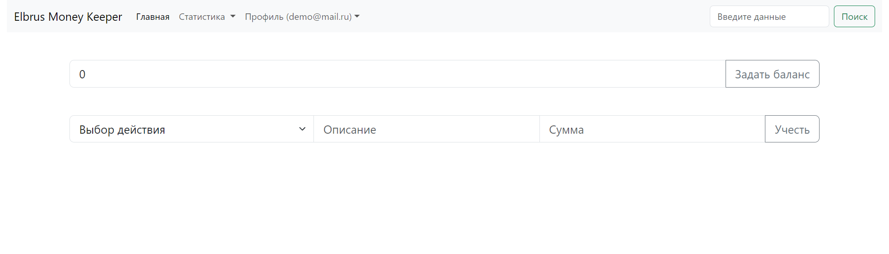
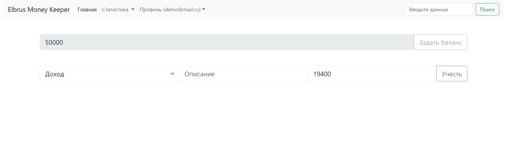
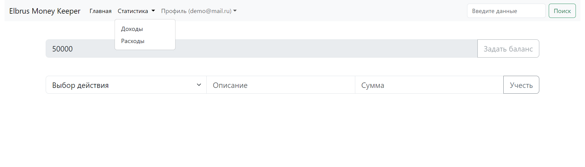
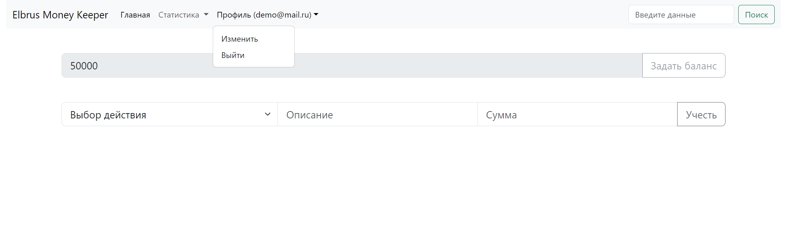
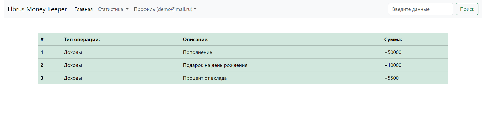
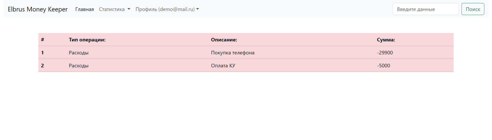
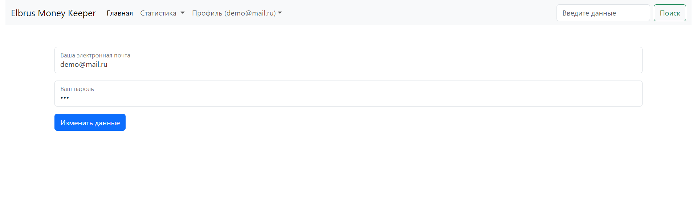

# Приложение учёта доходов и расходов Elbrus Money Keeper

## Описание проекта

Добро пожаловать в наш проект! 

Мы будем разрабатывать приложение для учёта доходов и расходов.
Твоя задача в первую очередь увидеть работу веб-разработчика изнутри, понять как формируется приложение и попрактиковаться в разработке на JavaScript. 
Возможно ты вообще никогда не имел(-ла) опыта в написании кода, но тебе очень хотелось попробовать, этот проект как раз для этого.

Итогом станет проект который будет работать на сервисе [GitHub Pages](https://pages.github.com/), в дальнейшем ты сможешь его улучшать и расширять по своему желанию.

## Необходимое ПО для реализации приложения:

- [VS Code](https://code.visualstudio.com/) (популярный редактор кода с удобным функционалом)
- [Google Chrome](https://www.google.com/intl/ru_ru/chrome/) (браузер для просмотра и рзработки любых веб-приложений)
- [Git](https://git-scm.com/downloads) (программа для управления версиями твоего кода)

### Релиз 0: Определение стуктуры и декомпозиция задач

Декомпозиция — разбиение сложной задачи на более мелкие и управляемые подзадачи. 
Важно определить основные этапы выполнения задачи и разбить их на более простые шаги. 
Таким образом, проще контролировать процесс выполнения и обеспечить успешное завершение проекта.

Соответствено сейчас у тебя есть:
- папка `css` с файлом `bootstrap.min.css` c миницифированным css-кодом из фреймворка [Bootstrap](https://getbootstrap.com/), который используется для основной стилизации приложения. Для собственной реализации стилей используй файл `style.css`.
- папка `img` с заготовленными файлами изображений: `.png` для `favicon` (значок веб-сайта или веб-страницы)
- папка `js` с заготовленными файлами скриптов: `auth.js`, `dashboard.js`, `expenses.js`, `income.js`, `profile.js`, где будет написана вся логика твоего приложения на языке JavaScript. Минифицированный файл `bootstrap.bundle.min.js` отвечает за логику [Bootstrap](https://getbootstrap.com/).
- папка `assets` с примерами интерфейса приложения `Elbrus Money Keeper`
- заготовленные файлы: `index.html`, `dashboard.html`, `expenses.html`, `income.html`, `profile.html` для использования в приложении, также ты можешь использовать свои `.html` файлы

Важно учесть, что приложение нужно "развернуть" на сервисе [`GitHub Pages`](https://pages.github.com/) для этого нужно сделать ряд первичных действий:
- проверить что установлен сам `Git` с помощью команды в терминале: `git --version`, если после выполнения появится версия то `Git` установлен
- создать аккаунт в сервисе [`GitHub`](https://github.com/signup)

Любая разработка использует подход в виде релизов, каждый из которых выполняет поставленную задачу.
Это был вводый релиз.

### Релиз 1: Базовая аутентификация

Следующей задачей будет реализовать твою первую аутентификацию в приложение.
Кто-то уже знает что означает это слово, а кому-то нужно пояснить подробнее, что это процесс проверки пользователя для дальнешейго использовании в приложении. 
В нашем приложении за это будут отвечать файлы: `index.html` и `auth.js`.

Из основных данных которые мы будем использовать в приложении это: `электронная почта/email` и `пароль/password`, для реализации сохранения введёных данных рекомендуем изучить свойство `localStorage`. С помощью него можно сохранить ранее ведённые данные для дальнейшего сравнения при последующих попытках входа. Более подробнее можно узнать [здесь](https://developer.mozilla.org/ru/docs/Web/API/Window/localStorage).

Лучшим решением будет использование объекта с ключами описывающие данные, пример:

```js
const userData = {            
    email: '',
    password: '',
    balance: null,
    income: [],
    expenses: []
}
```

Для установки значений в `localStorage` используй следующий пример:

```js
// где 'userData' название ключа в localStorage
// JSON.stringify(userData) форматирование данных в строку и асоциация их с ключом 'userData'
localStorage.setItem('userData', JSON.stringify(userData));
```

В дальнейшем все данные будут использовать этот объект.

В файле `index.html` есть пример кода для реализации формы которая будет обрабатывать введёные данные:

```html
<form class="mt-3" id="authForm" method="GET" action="/dashboard.html">
    <div class="form-floating mb-3">
        <input required name="email" type="email" class="form-control" placeholder>
        <label>Ваша электронная почта</label>
    </div>
    <div class="form-floating mb-3">
        <input required name="password" type="password" class="form-control" placeholder>
        <label>Ваш пароль</label>
    </div>
    <button type="submit" class="btn btn-primary">Далее</button>          
</form>
```

Не забудь подключить скрипт `auth.js` в файле `index.html` в теге `<head>` для применения JavaScript на странице.

Пример страницы `index.html`:


### Релиз 2: Функционал панели управления

Теперь когда приложение работает с пользовательскими данными нужно чтобы клиент перешёл на `Dashboard`, за это отвечают файлы `dashboard.html` и `dashboard.js`.

В файле `dashboard.html` есть код описывающий панель навигации:

```html
<section class="container-fluid mb-5">
    <nav class="navbar navbar-expand-lg bg-body-tertiary">
        <div class="container-fluid">
            <a class="navbar-brand" href="/dashboard.html">Elbrus Money Keeper</a>
            <button class="navbar-toggler" type="button" data-bs-toggle="collapse" data-bs-target="#navbarSupportedContent" aria-controls="navbarSupportedContent" aria-expanded="false" aria-label="Toggle navigation">
            <span class="navbar-toggler-icon"></span>
            </button>
            <div class="collapse navbar-collapse" id="navbarSupportedContent">
            <ul class="navbar-nav me-auto mb-2 mb-lg-0">
                <li class="nav-item">
                <a class="nav-link active" aria-current="page" href="/dashboard.html">Главная</a>
                </li>
                <li class="nav-item dropdown">
                <a class="nav-link dropdown-toggle" href="#" role="button" data-bs-toggle="dropdown" aria-expanded="false">
                    Статистика
                </a>
                <ul class="dropdown-menu">
                    <li><a class="dropdown-item" href="/income.html">Доходы</a></li>
                    <li><a class="dropdown-item" href="/expenses.html">Расходы</a></li>
                </ul>
                </li>
                <li class="nav-item dropdown">
                <a id="profileName" class="nav-link dropdown-toggle" href="#" role="button" data-bs-toggle="dropdown" aria-expanded="false">
                    Профиль ()
                </a>
                <ul class="dropdown-menu">
                    <li><a class="dropdown-item" href="/profile.html">Изменить</a></li>
                    <li><button id="logoutBtn" class="dropdown-item">Выйти</button></li>
                </ul>
                </li>
            </ul>
            <form class="d-flex" role="search">
                <input class="form-control me-2" type="search" placeholder="Введите данные" aria-label="Search">
                <button class="btn btn-outline-success" type="submit">Поиск</button>
            </form>
            </div>
        </div>
    </nav>
</section>
```

Пример страницы `dashboard.html`:


В этом же файле есть код описывающий поля ввода стартового баланса:

```html
<section class="container">
    <div class="input-group input-group-lg mb-5">
        <input id="balance" type="number" class="form-control" placeholder="Стартовая сумма">
        <button id="btnSetBalance" class="btn btn-outline-secondary" type="button">Задать баланс</button>
    </div>
</section>
```
Задача сделать возможность установки стартового баланса, после установки возможность изменить стартовый баланс заблокирована.
Используй идентификаторы html тегов чтобы обращаться к ним, для получения значений, пример:

```js
const balance = document.querySelector('#balance');
const btnSetBalance = document.querySelector('#btnSetBalance');

if (btnSetBalance) {
    btnSetBalance.addEventListener('click', () => {
        const data = JSON.parse(userDataStorage);            
        data.income.push({type: 'income', description: 'Пополнение', sum: Number(balance.value)});
        data.balance = Number(balance.value);

        localStorage.setItem('userData', JSON.stringify(data))

        balance.setAttribute('disabled', true);
        btnSetBalance.setAttribute('disabled', true);
    })
}
```

Все данные хранятся в `localStorage`, пример получения данных:

```js
const userDataStorage = localStorage.getItem('userData');
userDataStorage // объект в виде строкеи

const objUserDataStorage = JSON.parse(userDataStorage)
objUserDataStorage // полноценный объект
```

Пример страницы `dashboard.html` после установки баланса:


Пример страницы `dashboard.html` выпадающее меню статистики:


Пример страницы `dashboard.html` выпадающее меню профиля:


Не забудь подключить скрипт `dashboard.js` в файле `dashboard.html` в теге `<head>` для применения JavaScript на странице.

### Релиз 3: Форма учёта доходов и расходов

В файле `dashboard.html` есть блок кода описывающий поля учёта операций доходов и расходов:

```html
<div class="input-group input-group-lg">
    <select class="form-select" id="typeTransaction" >
        <option selected>Выбор действия</option>
        <option value="income">Доход</option>
        <option value="expenses">Расход</option>          
    </select>
    <input type="text" class="form-control" id="descTransaction" placeholder="Описание">
    <input type="number" class="form-control" id="sumTransaction" placeholder="Сумма">
    <button id="btnUpdateBalance" class="btn btn-outline-secondary" type="button">Учесть</button>
</div>
```

Используя идентификатор кнопки, нужно наполнить массив `доходов/income` или `расходов/expenses` в зависимости от выбранного варината, пример:

```js
const btnUpdateBalance = document.querySelector('#btnUpdateBalance');
const typeTransaction = document.querySelector('#typeTransaction');

btnUpdateBalance.addEventListener('click', () => {
    const transaction = {
        type: typeTransaction.value,
        description: descTransaction.value,
        sum: Number(sumTransaction.value)
    }

    if (typeTransaction.value === 'income' || typeTransaction.value === 'expenses') {
        const data = JSON.parse(userDataStorage);
        
        data[typeTransaction.value].push(transaction);            
        data.balance = data.income.reduce((total, income) => total + income.sum, 0) - data.expenses.reduce((total, expense) => total + expense.sum, 0);

        balance.value = data.balance;
        balance.setAttribute('disabled', true);
        btnSetBalance.setAttribute('disabled', true);

        localStorage.setItem('userData', JSON.stringify(data));
    }
})
```

### Релиз 4: Разработка интерфейсов статистики

Когда `localStorage` пополняется нашими операциями с доходами и расходами массивы `income` и `expenses` можно использовать в других файлах для вывода статистики.

Пример формирования статистики для доходов (расходы делаются по аналогии):

```js
const incomeTable = document.querySelector('#incomeTable');

if (incomeTable) {
    const incomeArr = JSON.parse(localStorage.getItem('userData')).income;

    incomeArr.forEach((el, index) => {
        const tr = document.createElement('tr');
        tr.classList.add("table-success")

        const thCount = document.createElement('th');
        thCount.insertAdjacentHTML('beforeend', index + 1);

        const tdType = document.createElement('td');
        tdType.insertAdjacentHTML('beforeend', 'Доходы');

        const tdDesc = document.createElement('td');
        tdDesc.insertAdjacentHTML('beforeend', el.description);

        const tdSum = document.createElement('td')
        tdSum.insertAdjacentHTML('beforeend', `+${el.sum}`);

        tr.appendChild(thCount)
        tr.appendChild(tdType)
        tr.appendChild(tdDesc)
        tr.appendChild(tdSum)

        incomeTable.appendChild(tr)
    })
}
```

Пример страницы статистики доходов `income.html`:


Пример страницы статистики расходов `expenses.html`:


Не забудь подключить скрипты в файлах `income.html` и `expenses.html` в теге `<head>` для применения JavaScript на странице.

### Релиз 5: Работа с профилем

Файлы `profile.html` и `profile.js` отвечают за редактирование данных пользователя, пример html кода:

```html
<section class="container">
    <form class="mt-3" id="changeForm" method="GET" action="/dashboard.html">
    <div class="form-floating mb-3">
        <input required name="email" type="email" class="form-control" placeholder>
        <label>Ваша электронная почта</label>
    </div>
    <div class="form-floating mb-3">
        <input required name="password" type="password" class="form-control" placeholder>
        <label>Ваш пароль</label>
    </div>
    <button type="submit" class="btn btn-primary">Изменить данные</button>          
    </form>
</section>
```

Пример JavaScript кода:

```js
const changeForm = document.querySelector('#changeForm');

if (changeForm) {
    const userData = JSON.parse(localStorage.getItem('userData'))
    changeForm.email.value = userData.email;
    changeForm.password.value = userData.password;

    changeForm.addEventListener('submit', () => {
        localStorage.setItem('userData', JSON.stringify({...userData, email: changeForm.email.value, password: changeForm.password.value }));
        window.location.href = '/dashboard.html';
    })
}
```

Пример страницы профиля `profile.html`:


### Релиз 6: Первая реализация деплоя/развёртывания на GitHub Pages

Пришла пора самого интересного!

Когда основной функционал готов, его нужно ещё раз проверить и после задеплоить/развернуть в GitHub Pages.

Этапы:

1. Создать публичный репозиторий в [GitHub](https://github.com/new) со специальным названием: `xxx.github.io`, где `xxx` ваше имя пользователя GitHub
2. В папке приложения Elbrus Money Keeper выполните команду: `git init` для инициализации локального git проекта
3. Выполнить команду: `git add .` для добавления всех файлов в будущий коммит
4. Выполнить команду: `git commit -m "Init commit"` для фиксации текущией версии файлов в коммите с комментарием "Init commit"
5. Выполнить команду: `git branch -M main` для назначение ветки main, как главной ветки проекта
6. Выполнить команду: `git remote add origin git@github.com:Xxx/xxx.github.io.git`, где `xxx` ваше имя пользователя GitHub
7. Выполнить команду: `git push -u origin main` для отправки изменений в GitHub, после 3-5 минут сайт должен появится по адресу `xxx.github.io`, где `xxx` ваше имя пользователя GitHub